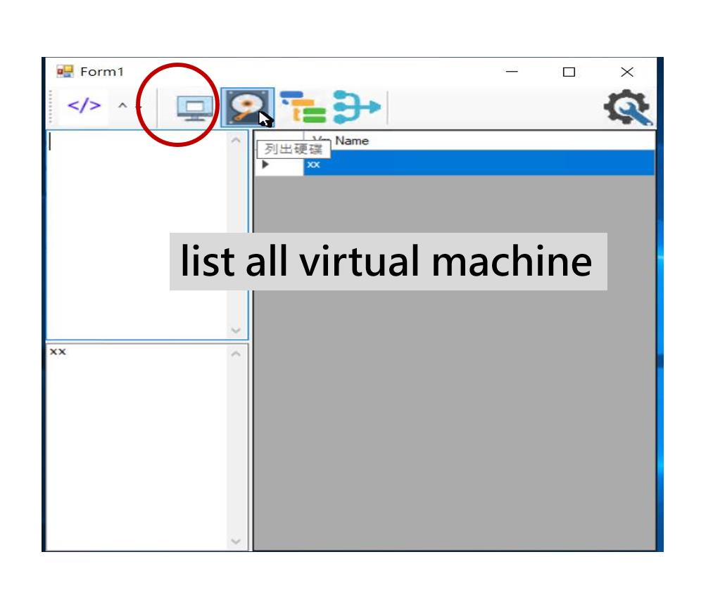
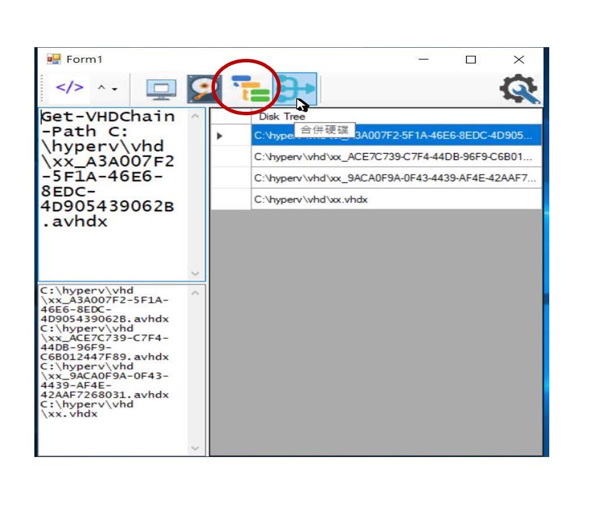
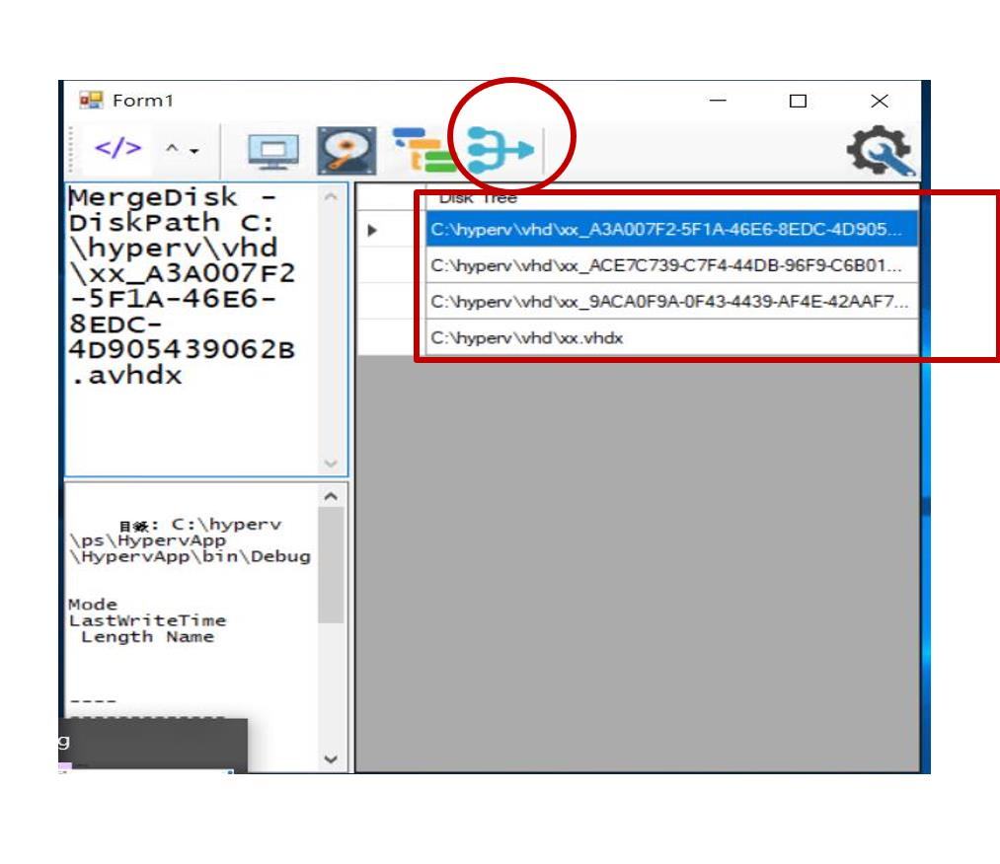

# Introduction
This utility is only for merging disk. While merging disk, this app will leave the original tree structure along, and make new hard disk.

# demo
### list all virtual machine and choose one to list disk

### list all disk for choosen virtual machine

### list tree structure for choosen hard disk

### merge disk from specified item 
when button is clicked, disk will be merged from what is specified till the very parent.

 
