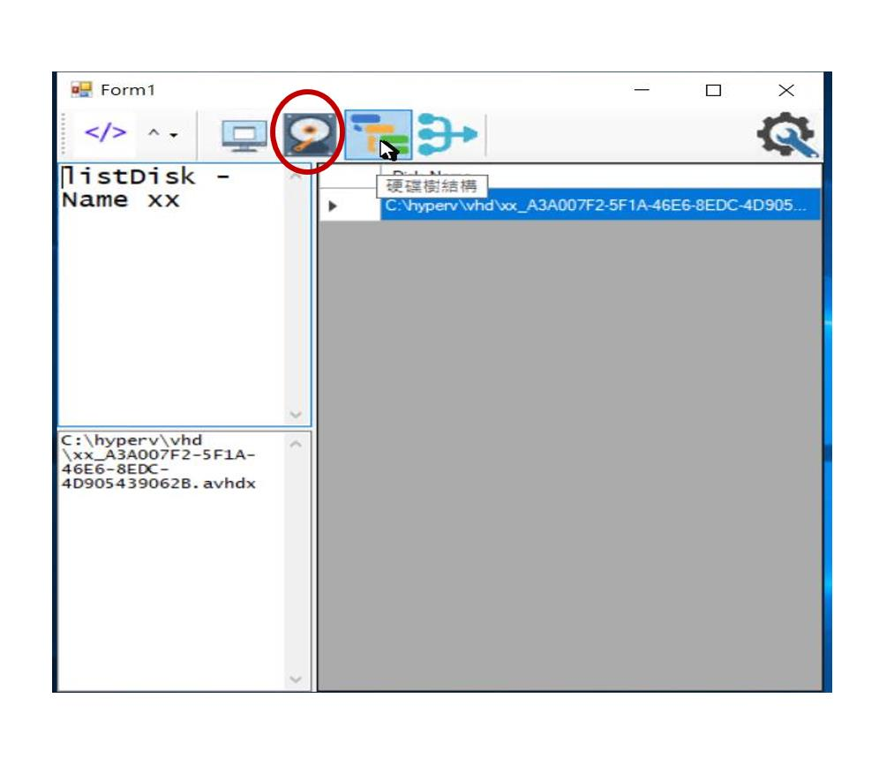

# Introduction
this utility is only for merging disk.
#demo
## list all virtual machine and choose

## list all disk for choosen virtual machine

## list tree structure for choosen hard disk

## merge disk from specified item 
when button is clicked, disk will be merged from what is specified till the very parent.

 
